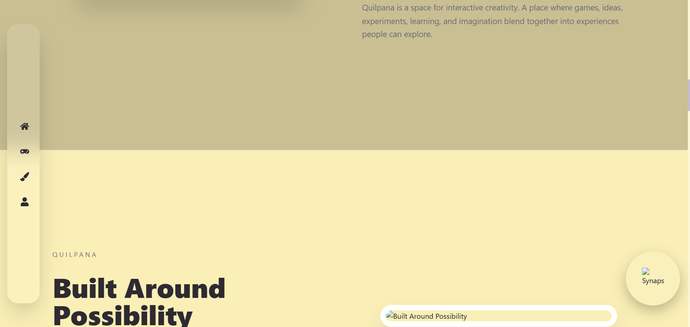
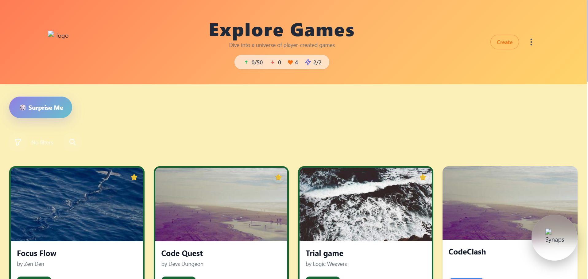
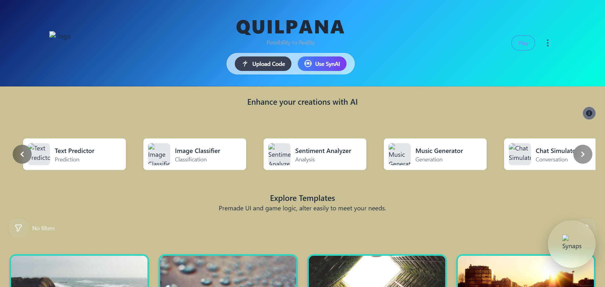
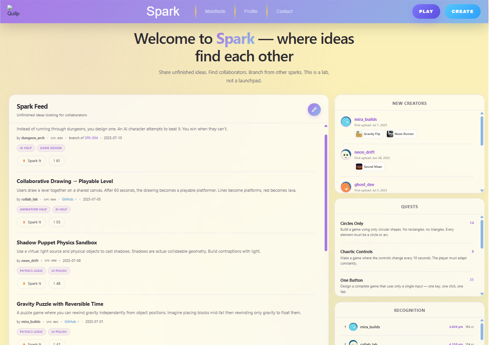
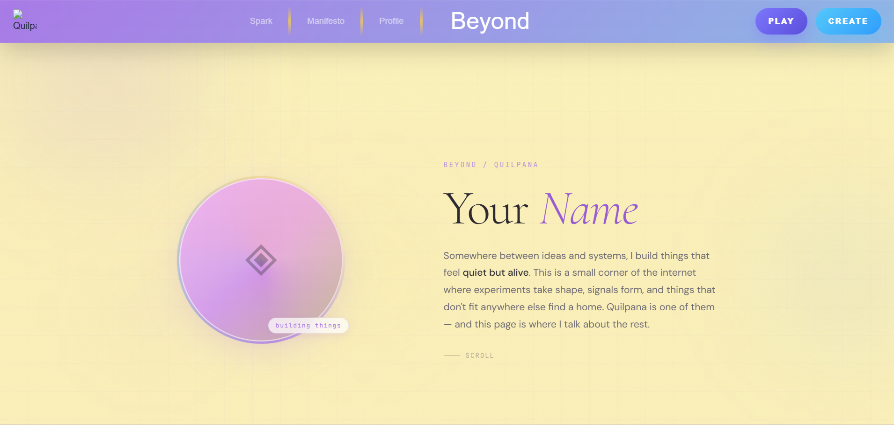
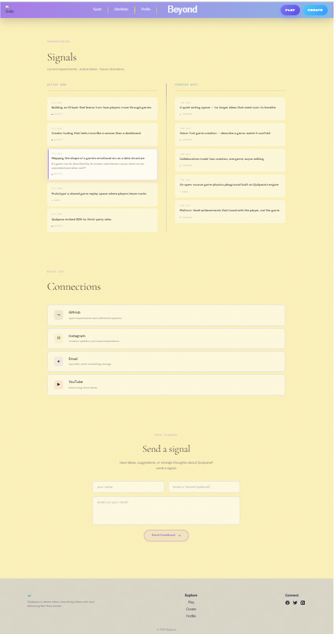
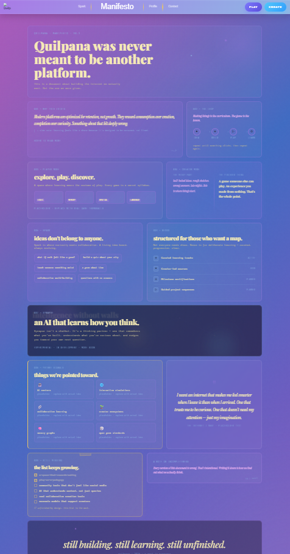

# Quilpana

An experimental platform where creativity becomes interactive.  
Quilpana blends games, learning, storytelling, AI assistance, and playful systems into one evolving creative space.

Built as a long-term project exploring immersive interfaces, creator tools, and interactive experiences.

---

## Preview

### Landing Experience




### Player mode


### Creator Mode


### Spark page


### Beyond Page



### Manifesto page


---

## Current Features

- Immersive animated landing page
- Scroll-based GSAP transitions
- Reusable landing section system
- Floating interactive sidebar
- Synapse AI chat interface
- Local chat memory using localStorage
- Typing animation for AI responses
- Creator Mode foundation
- AI template carousel
- Search, sorting, and filtering system
- Responsive component architecture
- Modular React + TypeScript structure
- Smooth Framer Motion animations

---

## Tech Stack

React | TypeScript | Tailwind CSS | Framer Motion | GSAP | React Router | LocalStorage

---

## Project Structure

```
src/
│
├── components/
│   ├── landing/
│   ├── chat/
│   ├── creator/
│   └── shared/
│
├── hooks/
├── pages/
├── types/
├── constants/
├── services/
└── styles/

```

## Coming next

- Authentication and profile page
- More community based features
- AI integration 
- Upload game feature
- Logo and style centralization